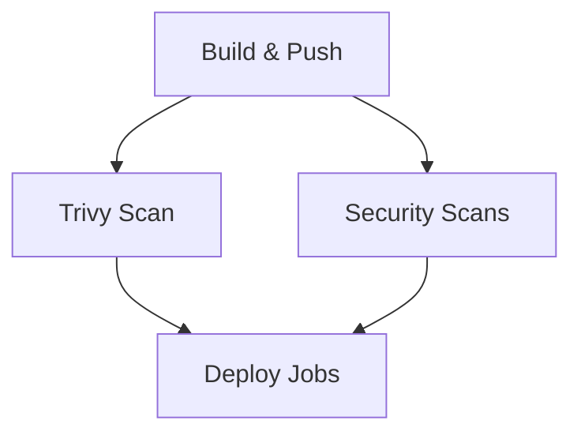

# 🔒 Security Scanning Setup

This document describes the comprehensive security scanning setup using free and open-source tools instead of Fortify.

## 🛠️ Security Tools Used

### **SAST (Static Application Security Testing)**

1. **CodeQL** - GitHub's free static analysis tool
   - Scans for security vulnerabilities in JavaScript/Node.js
   - Results appear in GitHub Security tab
   - No additional setup required

2. **Semgrep** - Fast, open-source static analysis
   - Scans for security issues, secrets, and OWASP Top 10
   - Optional: Sign up at [semgrep.dev](https://semgrep.dev) for better results
   - Free tier available

3. **ESLint Security Plugin** - JavaScript-specific security rules
   - Detects common Node.js security issues
   - Scans for unsafe patterns and vulnerabilities
   - Configured in `.eslintrc.security.js`

4. **NPM Audit** - Dependency vulnerability scanning
   - Scans for known vulnerabilities in npm packages
   - Checks both development and production dependencies

### **DAST (Dynamic Application Security Testing)**

1. **OWASP ZAP** - Industry-standard web application scanner
   - Scans running application for vulnerabilities
   - Performs both baseline and full scans
   - Results in HTML and JSON formats

2. **Nuclei** - Modern vulnerability scanner
   - Fast scanning with extensive template library
   - Scans for CVEs, misconfigurations, and exposures
   - JSON output for integration

## 🚀 Setup Instructions

### **1. Repository Secrets**

Add these secrets to your GitHub repository:

```yaml
# Required for AWS ECR access
AWS_ACCESS_KEY_ID: your-aws-access-key
AWS_SECRET_ACCESS_KEY: your-aws-secret-key

# Required for Git operations
REPO_TOKEN_PAT: your-github-personal-access-token

# Optional: For enhanced Semgrep results
SEMGREP_APP_TOKEN: your-semgrep-token (optional)
```

### **2. Install Dependencies**

```bash
npm install
```

The security scanning workflow will automatically install additional tools during execution.

### **3. Local Security Testing**

You can run security scans locally:

```bash
# ESLint Security Scan
npx eslint . --config .eslintrc.security.js

# NPM Audit
npm audit --audit-level=moderate

# NPM Audit (Production only)
npm audit --audit-level=moderate --production
```

## 📊 Security Scan Results

### **Where to Find Results**

1. **GitHub Security Tab** - CodeQL results
2. **Workflow Artifacts** - All scan results
3. **Workflow Summary** - High-level overview
4. **PR Comments** - Automatic security reports

### **Artifact Files**

- `semgrep-results/` - Semgrep scan results
- `eslint-security-results/` - ESLint security findings
- `npm-audit-results/` - Dependency vulnerability reports
- `zap-results/` - OWASP ZAP scan reports
- `nuclei-results/` - Nuclei vulnerability scan results

## 🔧 Configuration

### **ESLint Security Rules**

The `.eslintrc.security.js` file contains security-specific rules:

- **Object injection detection**
- **Unsafe regex patterns**
- **Child process vulnerabilities**
- **File system security issues**
- **Timing attack detection**

### **OWASP ZAP Rules**

The `.zap/rules.tsv` file configures which ZAP rules to ignore:

- Cookie security headers
- Cache control headers
- Frame options
- Content type options
- Debug information leaks

### **Nuclei Templates**

Nuclei uses these template categories:

- `cves/` - Known CVE vulnerabilities
- `exposures/` - Information disclosure
- `vulnerabilities/` - General security issues
- `misconfiguration/` - Configuration problems

## 🎯 Security Thresholds

### **Current Thresholds**

- **Critical Issues**: Pipeline fails immediately
- **High Issues**: 
  - ESLint: 5+ issues fail pipeline
  - DAST: 3+ issues fail pipeline
- **Medium/Low Issues**: Warnings only

### **Customizing Thresholds**

Edit the security workflow to adjust thresholds:

```yaml
# In security-scan.yml
if [ "$HIGH_COUNT" -gt 5 ]; then
  echo "⚠️ SAST scan warning: $HIGH_COUNT high issues found (threshold: 5)"
  exit 1
fi
```

## 🔄 Workflow Integration

### **When Scans Run**

- **All Branches**: CodeQL, Trivy
- **Dev Branch**: Full SAST + DAST suite
- **PRs**: All scans with PR comments

### **Pipeline Dependencies**



## 🆚 Comparison with Fortify

| Feature | Free Tools | Fortify |
|---------|------------|---------|
| **Cost** | Free | Commercial |
| **SAST** | CodeQL, Semgrep, ESLint | Fortify SCA |
| **DAST** | OWASP ZAP, Nuclei | Fortify WebInspect |
| **Setup** | Minimal | Complex |
| **Maintenance** | Community | Vendor support |
| **Integration** | GitHub native | Custom setup |

## 🚨 Troubleshooting

### **Common Issues**

1. **Semgrep Token Missing**
   - Optional: Sign up at semgrep.dev
   - Add `SEMGREP_APP_TOKEN` secret
   - Or remove Semgrep job if not needed

2. **ZAP Scan Timeout**
   - Increase timeout in workflow
   - Check application health endpoint
   - Verify port accessibility

3. **Nuclei Installation Issues**
   - Go must be installed
   - Check Go version compatibility
   - Verify network connectivity

### **Performance Optimization**

- **Parallel Scans**: SAST and DAST run in parallel
- **Caching**: NPM dependencies cached
- **Selective Scanning**: Only on dev branch for full suite

## 📈 Monitoring and Reporting

### **Security Metrics**

- Vulnerability count by severity
- Scan execution time
- False positive rate
- Coverage metrics

### **Automated Reporting**

- GitHub Security tab integration
- PR comment summaries
- Artifact storage (30 days)
- Workflow summary reports

## 🔐 Security Best Practices

1. **Regular Updates**: Keep security tools updated
2. **Threshold Tuning**: Adjust based on your risk tolerance
3. **False Positive Management**: Review and tune rules
4. **Integration**: Include security in development workflow
5. **Training**: Educate team on security findings

## 📚 Additional Resources

- [OWASP ZAP Documentation](https://www.zaproxy.org/docs/)
- [Nuclei Templates](https://github.com/projectdiscovery/nuclei-templates)
- [Semgrep Rules](https://semgrep.dev/rules)
- [CodeQL Documentation](https://codeql.github.com/docs/)
- [ESLint Security Plugin](https://github.com/eslint-community/eslint-plugin-security)

---

**Note**: This security scanning setup provides comprehensive coverage using free tools. For enterprise requirements, consider commercial solutions like Fortify, Checkmarx, or Veracode.
